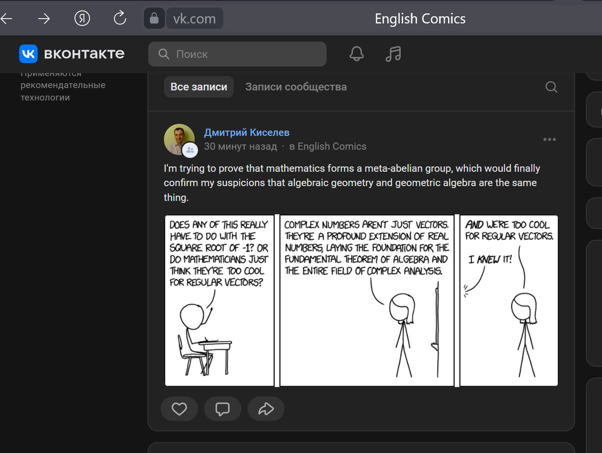

# VK-Comics-Posting
Публикация комиксов на стену VK сообщества

### Как установить

Python3 должен быть установлен. Далее загрузите ряд зависимостей с помощью pip (pip3):

    pip install -r requirements.txt

Создайте Сообщество в VK, где будете выкладывать комиксы ([Создать Сообщество](https://vk.com/dev/implicit_flow_user)).
Далее создайте Приложение, оно нужно, чтобы получить токен ([Создать Приложение](https://vk.com/apps?act=manage)).
Затем получите токен, чтобы выкладывать изображения на стену ([Получить Токен](https://vk.com/dev/implicit_flow_user)). 
Вам потребуются следующие права: `photos`, `groups`, `wall` и `offline`. Для этого укажите их в параметре `scope` через запятую.

Рядом с программой создайте файл `.env`. Его содержимое должно быть похожим на это:

    TG_GROUP_ID=4XXXXXXXX5
    TG_TOKEN=1534gf5vf4433xxXXXxXxXxXXXXXX

`TG_GROUP_ID` - айди вашего сообщества. Узнать его можно [здесь](https://regvk.com/id/).
`TG_TOKEN` - токен, полученный на предыдущем шаге.

### Запуск

Запуск осуществляется командой:

    python3 main.py

### Пример успешного запуска скрипта

При успешном запуске скрипта на стене сообщества должен появиться случайный комикс.

После публикации файл с изображениям комикса удаляется с локального диска.

При ошибке обращения к API VK, будет выдано соответствующее сообщение - `Ошибка API VK`.

### Цели проекта

Код написан в учебных целях — это урок в курсе по Python на сайте [Devman](https://dvmn.org).

